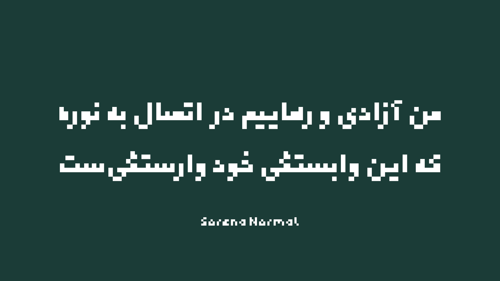
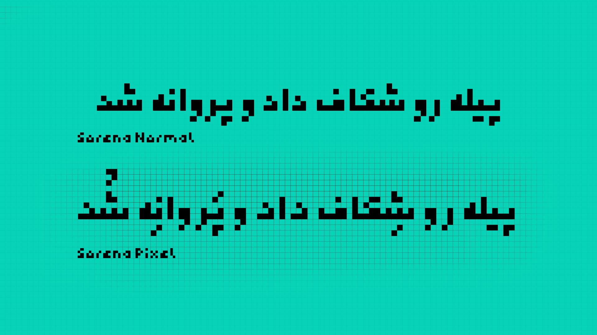

# Sorena | سورنا

سورنا یک تایپ‎‌فیس پیکسلی است که با ایدۀ اولیه از [عرفان خیراللهی](https://github.com/ekm507) طراحی شده است. سعی شده با اینکه شرایط طراحی سورنا بسیار سخت است و جزئیات به تنگ می‌آیند، نتیجۀ کار دلچسب و زیبا باشد. سورنا در دو حالت Normal و Pixel طراحی و ساخته شده است. سورنا از زبان های فارسی، عربی، کوردی، اردو و انگلیسی پشتیبانی می‌کند.

## Masters

فونت سورنا در دو حالت Normal & Pixel ساخته شده است. حالت Pixel کاملاً بر اساس قواعد پیکسل است و به صورت کامل در مربع های پیکسلی قرار می‌گیرد. حالت Normal بر خلاف حالت Pixel به این قواعد به صورت کامل پایبند نیست؛ یعنی بخاطر زیبایی بیشتر بعضی موارد فونت به قواعد پیکسلی پایبند نیست.
